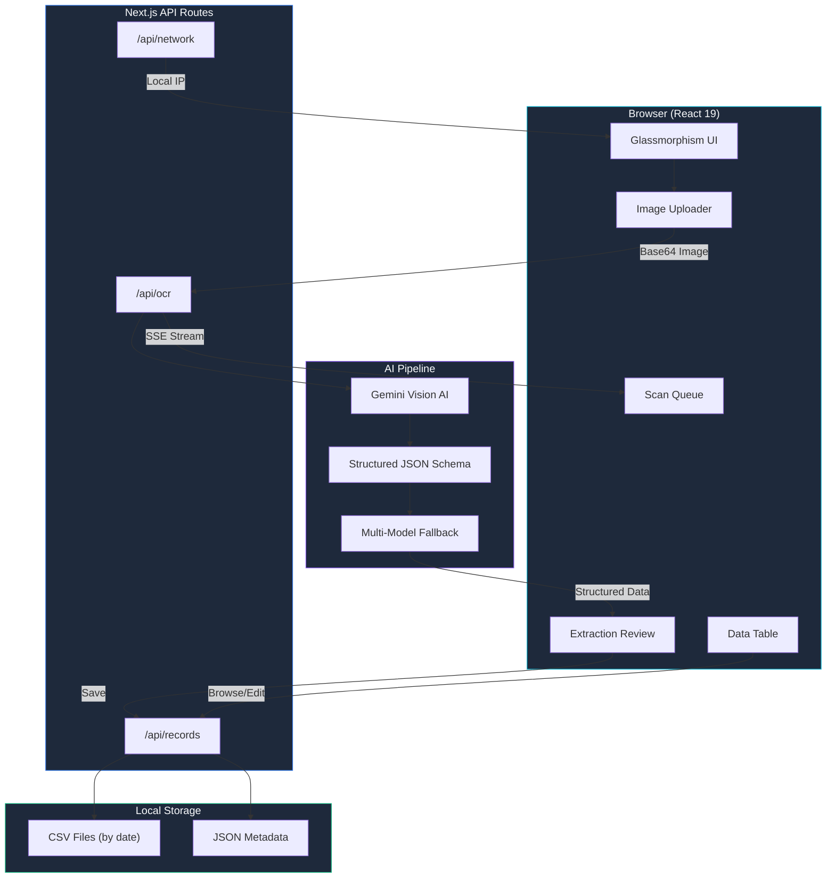

<div align="center">

# 🏥 MedScan AI

### AI-Powered Medicine OCR Agent

*Instantly extract structured medicine data from invoices, challans, and packaging photos using Gemini Vision AI — runs 100% locally on your machine.*

[](https://nextjs.org/)
[](https://react.dev/)
[](https://ai.google.dev/)
[](https://tailwindcss.com/)
[](LICENSE)

---

**⚡ Upload → AI Extracts → Review → Save** — complete pipeline in seconds

</div>

---

## ✨ Features

| Feature | Description |
|---------|-------------|
| 🤖 **Gemini Vision AI** | Multi-model fallback pipeline (Flash 8B → Flash → 3.6 Flash) with structured JSON output |
| 📸 **Smart Image Processing** | Upload photos of invoices, challans, medicine strips, or blister packs — AI auto-detects document type |
| 📊 **Structured Data Extraction** | Extracts medicine name, batch number, expiry, quantity, rate, amount + invoice metadata (IRN, ACK, customer info) |
| 🔄 **Real-time Streaming** | Server-Sent Events (SSE) streaming with live AI processing logs displayed in a terminal-style UI |
| 📱 **Mobile Camera Support** | Use your phone's camera over WiFi — auto-detects local network IP for seamless cross-device workflow |
| 📋 **Batch Processing** | Multi-image scan queue with parallel status tracking (pending → processing → done) |
| ✏️ **Inline Editing** | Review and correct AI-extracted data before saving — amber-highlighted fields for missing/low-confidence values |
| 🔍 **Duplicate Detection** | Automatic detection of duplicate rows based on medicine name + batch number |
| 💾 **CSV Storage & Export** | Save records by date, browse history, edit saved data, and export to CSV |
| 🧮 **Auto-Calculation** | Automatically computes Amount = Qty × Rate when values are available |
| 🌙 **Glassmorphism UI** | Stunning dark-mode interface with glass effects, gradient animations, and micro-interactions |
| 🔒 **100% Local** | All processing runs on your machine — no data leaves your network |

---

## 🏗️ Architecture



---

## 🚀 Quick Start

### Prerequisites

- **Node.js** v18+ — [Download](https://nodejs.org/)
- **Gemini API Key** (free) — [Get one here](https://aistudio.google.com/)

### Installation

```bash
# 1. Clone the repository
git clone https://github.com/Sumit00735/MedAiBot.git
cd MedAiBot

# 2. Install dependencies
npm install

# 3. Set up environment variables
cp .env.example .env.local
# Edit .env.local and add your Gemini API key

# 4. Start the development server
npm run dev
```

Open [http://localhost:3000](http://localhost:3000) — you're ready to scan! 🎉

### 📱 Use Your Phone Camera

1. Ensure your phone and PC are on the **same WiFi network**
2. Open the sidebar — look for the **phone camera** section showing your local IP
3. Open `http://<your-ip>:3000` on your phone's browser
4. Use your phone camera to capture medicine images directly!

---

## 📁 Project Structure

```
MedAiBot/
├── src/
│   ├── app/
│   │   ├── api/
│   │   │   ├── ocr/route.js          # AI extraction endpoint (SSE streaming)
│   │   │   ├── records/route.js       # CRUD operations for saved data
│   │   │   └── network/route.js       # Local network IP detection
│   │   ├── data/page.js               # Saved data browser & editor
│   │   ├── records/page.js            # Redirect to /data
│   │   ├── page.js                    # Main scan page
│   │   ├── layout.js                  # Root layout with metadata
│   │   └── globals.css                # Design system & styles
│   ├── components/
│   │   ├── scan/
│   │   │   ├── ImageUploader.jsx      # Drag & drop + camera upload
│   │   │   ├── ScanQueue.jsx          # Multi-image processing queue
│   │   │   ├── ExtractionReview.jsx   # Editable extraction results table
│   │   │   └── MetaFieldsForm.jsx     # Invoice metadata editor
│   │   ├── data/
│   │   │   └── DataTable.jsx          # Date-based data browser
│   │   ├── layout/
│   │   │   ├── AppShell.jsx           # Main app layout wrapper
│   │   │   └── Sidebar.jsx            # Navigation sidebar
│   │   └── shared/
│   │       ├── Toast.jsx              # Toast notification system
│   │       ├── FieldInput.jsx         # Smart input with missing field highlight
│   │       └── ConfirmDialog.jsx      # Confirmation modal
│   └── lib/
│       ├── ocr-pipeline.js            # Gemini AI extraction pipeline
│       ├── storage.js                 # CSV/JSON file operations
│       ├── constants.js               # Data schema & field mappings
│       └── utils.js                   # Utilities (CSV export, validation)
├── data/                              # Local data storage (gitignored)
├── public/                            # Static assets
├── .env.example                       # Environment variable template
├── next.config.mjs                    # Next.js configuration
├── package.json                       # Dependencies & scripts
└── start_app.bat                      # Windows one-click launcher
```

---

## ⚙️ API Documentation

### `POST /api/ocr`

Processes an image through the Gemini AI pipeline and returns extracted medicine data via SSE stream.

**Request Body:**
```json
{
  "image": "data:image/jpeg;base64,..."
}
```

**SSE Events:**
| Event Type | Payload | Description |
|-----------|---------|-------------|
| `log` | `{ message: string }` | Real-time processing status |
| `result` | `{ documentType, meta, items }` | Extracted structured data |
| `error` | `{ error: string }` | Error message |

### `GET /api/records?date=YYYY-MM-DD`

Retrieves saved medicine records for a specific date.

### `POST /api/records`

Saves extracted items to a date-specific CSV file.

### `PUT /api/records`

Updates existing records for a specific date.

### `DELETE /api/records?date=YYYY-MM-DD&row=N`

Deletes a specific row or entire day's records.

---

## 🛠️ Tech Stack

| Layer | Technology |
|-------|-----------|
| **Frontend** | React 19, Next.js 16 (App Router) |
| **Styling** | TailwindCSS 4, Custom CSS (Glassmorphism) |
| **AI/ML** | Google Gemini Vision API (multi-model fallback) |
| **Icons** | Lucide React |
| **Storage** | Local CSV + JSON files |
| **Streaming** | Server-Sent Events (SSE) |
| **Fonts** | Geist Sans & Geist Mono |

---

## 🧠 AI Pipeline Details

The extraction pipeline uses a sophisticated multi-model fallback strategy:

```
Image Upload → Resize (800px max) → Base64 Encode
    ↓
Gemini Flash 8B (fastest, cheapest)
    ↓ fails? (404/429/401)
Gemini Flash (balanced)
    ↓ fails?
Gemini 3.6 Flash → Gemini 3.5 Flash → Gemini 3.7 Flash
    ↓
Structured JSON Schema Extraction
    ↓
Post-processing (renumber, calculate amounts, detect missing fields)
```

**Key capabilities:**
- 📋 Reads blurry text using context clues (batch formats, expiry date patterns)
- 📦 Detects document type (invoice vs. challan vs. medicine packaging)
- 🔢 Auto-calculates Amount when Qty and Rate are available
- ⚠️ Flags missing/low-confidence fields for human review

---

## 🤝 Contributing

Contributions are welcome! Please read the [Contributing Guide](CONTRIBUTING.md) for details on our code of conduct and submission process.

---

## 📄 License

This project is licensed under the **MIT License** — see the [LICENSE](LICENSE) file for details.

---

## 👤 Author

**Sumit Chauhan** — [@Sumit00735](https://github.com/Sumit00735)

---

<div align="center">

Built with ❤️ using Next.js and Gemini AI

⭐ **Star this repo** if you found it useful!

</div>
